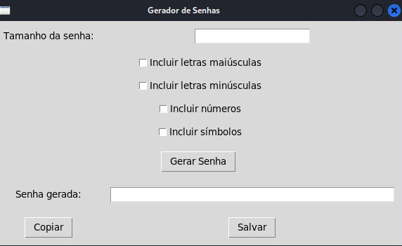

# Gerador de Senhas

Este é um simples gerador de senhas em Python que permite criar senhas seguras com opções de personalização, como incluir letras maiúsculas, minúsculas, números e símbolos.

## Interface do Gerador de Senhas

Abaixo está uma captura de tela da interface gerada pelo aplicativo:



## Pré-requisitos

Antes de começar, você precisa ter os seguintes softwares instalados em sua máquina:

- [Python 3.x](https://www.python.org/downloads/)
- [pip](https://pip.pypa.io/en/stable/installation/) (geralmente já incluído com o Python)
- [pyperclip](https://pypi.org/project/pyperclip/) (para copiar a senha para a área de transferência)

## Fork do Repositório

Para trabalhar neste projeto, siga os passos abaixo:

### 1. Criar um Fork do Repositório

1. Acesse o repositório no GitHub.

2. Clique no botão **Fork** no canto superior direito da página.

### 2. Clonar o Repositório Forkado

#### No Windows

1. Abra o **Prompt de Comando** ou o **PowerShell**.

2. Navegue até o diretório onde deseja clonar o repositório:

   ```bash
   cd caminho\para\seu\diretorio
   ```

3. Execute o comando para clonar o repositório:

    ```bash
    git clone https://github.com/SEU_USUARIO/NOME_DO_REPOSITORIO.git
    ```
#### No Linux

1. Abra o **Terminal**.

2.  Navegue até o diretório onde deseja clonar o repositório:

    ```bash
    cd caminho/para/seu/diretorio
    ```
3.  Execute o comando para clonar o repositório:

    ```bash
    git clone https://github.com/SEU_USUARIO/NOME_DO_REPOSITORIO.git
    ```
### 3. Instalar  Dependências

1.  Navegue até o diretório do projeto clonado:

    ```bash
    cd NOME_DO_REPOSITORIO
    ```

2.  Instale as dependências necessárias para o projeto:

    ```bash
    pip install pyperclip
    ```
###  4. Executar o Script

1. Certifique-se de estar  no diretório do projeto:

2.  Execute o script:

    ```bash
    python gerador_senha.py
    ```
### 5. Usando o Gerador de Senhas

1. Insira o tamanho  da senha desejada.

2. Selecione as opções para incluir  letras maiúsculas, letras minúsculas, números e símbolos.

3. Clique em **Gerar Senha**.

4. A senha gerada aparece no campo abaixo.

5. Você pode copiar a senha para a  área de transferência clicando no botão **Copiar** ou salvar a senha em um arquivo clicando no botão  **Salvar**.